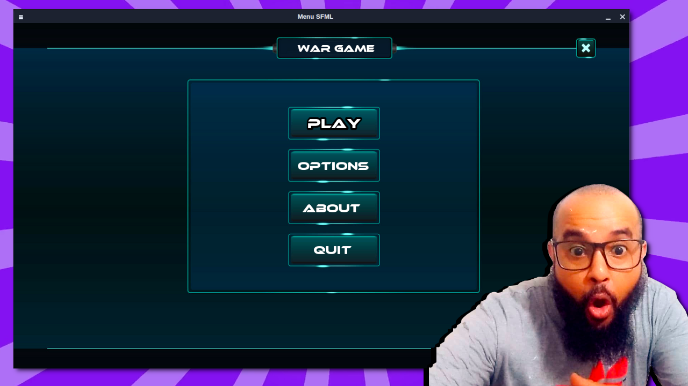

# menu-sfml
Example of a game menu made with C++ and SFML

This is the result of the tutorial made in the video below

[](https://youtu.be/h8-Q4eu3Qt4)

# Dependencies
+ [gcc/g++](https://gcc.gnu.org/)
+ [GNU Make](https://www.gnu.org/software/make/)
+ [SFML](https://www.sfml-dev.org/)

# Building

```sh
git clone https://github.com/terroo/menu-sfml
cd menu-sfml
make
```


